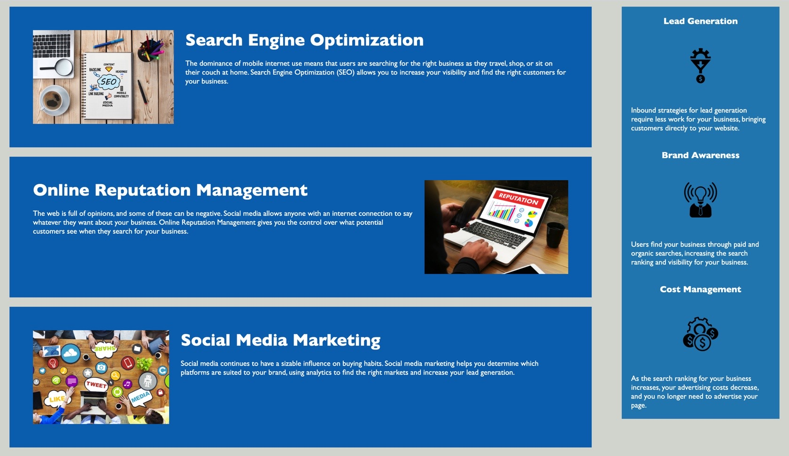

# HoriseonAccessibility
#### Repository for Homework 1, due Nov. 8, 2020.

### For this assignment, I have edited the original files that we were given to optimize accessibilities. 
#### **The ways in which I achieved this in the HTML file were:**
    * Ensuring all links have functionality
    * Adding highly descriptive accesibility text to all images
    * Using symantic elements to specify what type of content was referenced
    * Changing file locations and names within my local directory to allow for easier reference and linking
#### **The ways in which I achieved this in the CSS file were:**
    * Reducing redundancies by only creating section-specific tags when necessary, reducing excessive class creation
    * Condensing many styles which are seen throughout the webpage into the "body" tag
    * Changing the order of tags to follow the flow of sections
    * Placed the tags for headings, images, and specialized text together for easier reference
   

### [Horiseon Accessibility](https://meganbryan.github.io/HoriseonAccessibility/)

### 
### 

